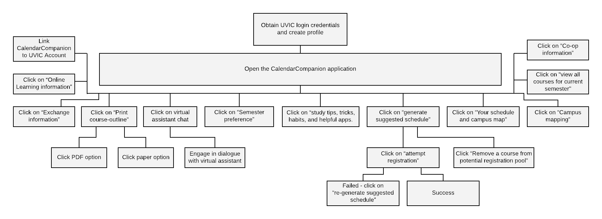

1. Obtain UVIC login credentials and create profile
2. Open the CalendarCompanion application 
    * Click on virtual assistant chat 
        * Engage in dialogue with virtual assistant
    * Click on "view all courses for current semester".
    * Click on "study tips, tricks, habits, and helpful apps."
    * Click on "generate suggested schedule". 
        * Click on "attempt registration" 
          * Success
          * Failed, click on "re-generate suggested schedule"
        * Click "Remove a course from potential registration pool"
    * Click on "Your schedule and campus map"
    * Click on "Campus mapping"
    * Click on "Co-op information"
    * Click on "Print course-outline" 
        * Click PDF option
        * Click paper option
    * Click on "Semester preference"
    * Click on "Exchange information"
    * Click on "Online Learning information"
    * Link CalendarCompanion to UVIC Account

