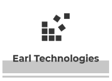

---
# Feel free to add content and custom Front Matter to this file.
# To modify the layout, see https://jekyllrb.com/docs/themes/#overriding-theme-defaults
title: Home
layout: default
---

Welcome to the Earl Technologies project website.
This is the home for assignment posts and project information for the University of Victoria SENG 310 course during Winter 2019.

The layout of the page will be by <b>phase</b>. Each phase is a group assignment which also marks a milestone completion for the end product of this course.

<b>Contributors</b> 
Alex Nguyen:V00894486 
Brendan Ciccone: V00871008 
Daniel Dubichev: V0877776 
Alex Deweert: V00855767

# [Phase 1 : Requirements Gathering]()
# [Phase 2 : Design]()
