
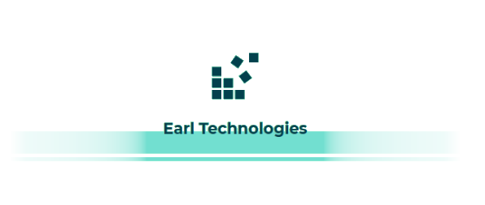

# Phase 2: Design

&nbsp;&nbsp;&nbsp;&nbsp;Welcome to the design portion of the CalendarCompanion application. Here we will discuss the design details surrounding a mobile implementation of Calendar Companion. We will provide design decisions, details, and prototypes.

&nbsp;&nbsp;&nbsp;&nbsp;This document serves to provide an overview of the design phase of the CalendarCompanion application. We will first provide a high level hierarchical overview and short description of each component in our design proposal. Next, each component will be be described in detail; each section will include a design decision rationale for the component in question (interface metaphors, widget choices, etc), plus how that portion of the design fulfills a requirement based on data gathered in Phase 1. Finally, each component section will include a low fidelity prototype, and a detailed description of the behavior of each component widget.

&nbsp;&nbsp;&nbsp;&nbsp;Using this document, a developer should be provided with enough detail that the application could be made with little to no additional guidance from the designers of the application. The Earl Technologies team is please to present the CalendarCompanion prototype and design document.
<!-- Design Desicion and Rationale
Requirement from Phase 1
Low Fidelity Prototype
Behavior -->

&nbsp; 

---

&nbsp; 
&nbsp; 
&nbsp; 

    <b>University of Victoria 
    SENG 310 Winter 2019 
    Prof. G. Tzanetakis  </b>
    &nbsp; 
    <b>Alex Nguyen:</b> V00894486 
    <b>Brendan Ciccone:</b> V00871008 
    <b>Daniel Dubichev:</b> V0877776 
    <b>Alex Deweert:</b> V00855767 
&nbsp; 
&nbsp; 
    
        <b>Phase 2: Design</b>
         
        <b>Calendar Companion</b>
    

&nbsp; 
&nbsp; 

# Contents

<ol>
  <li><a href = "#high_level_overview">Hierarchical overview</a></li>
  <li><a href = "#details">Details</a></li>
    <ol>
        <li><a href = "#login_page">Login Page</a></li>
        <li><a href = "#course_schedule">Course Schedule</a></li>
            <ol style = "list-style-type: upper-alpha">
                <li><a href = "#future_courses">Future Courses</a></li>
                <li><a href = "#weekly_timetable">Weekly Timetable</a></li>
                <li><a href = "#create_a_degree_map">Create a Degree Map</a></li>
                <li><a href = "#my_degree_maps">My Degree Maps</a></li>
            </ol>
        <li><a href = "#study_assistant">Study Assistant</a></li>
            <ol style = "list-style-type: upper-alpha">
                <li><a href = "#assignment_alarm">Assignment Alarm</a></li>
                <li><a href = "#study_tips_and_tricks">Study Tips and Tricks</a></li>
                <li><a href = "#test_reminders">Test Reminder</a></li>
                <li><a href = "#todo_check_list">Todo/Check List</a></li>
            </ol>
        <li><a href = "#map">Map</a></li>
        <li><a href = "#school_events">School Events</a></li>
        <li><a href = "#find_my_prof">Find My Prof</a></li>
            <ol style = "list-style-type: upper-alpha">
                <li><a href = "#contact_info_and_office_hours">Contact Info and Office Hours</a></li>
                <li><a href = "#professor_ratings">Professor Ratings</a></li>
            </ol>
        <li><a href = "#student_finances">Student Finances</a></li>
            <ol style = "list-style-type: upper-alpha">
                <li><a href = "#tuition_and_account_balance">Tution and Bank Account</a></li>
                <li><a href = "#one_card_account">One Card Account</a></li>
                <li><a href = "#link_bank_account">Link Bank Account</a></li>
                <li><a href = "#make_payment">Make Payment</a></li>
            </ol>
        <li><a href = "#user_account">User Account</a></li>
        <li><a href = "#help">Help</a></li>
            <ol style = "list-style-type: upper-alpha">
                <li><a href = "#calendar_companion_tutorial">CalendarCompanion Tutorial</a></li>
            </ol>
    </ol>
</ol>
&nbsp; 
&nbsp; 

---

&nbsp; 
&nbsp; 

# Hierarchical overview

<ol>
    <li><a href = "#login_page">Login Page</a>
         This is a standard login page that will display a CalendarCompanion logo. This page is allows a user to enter a netlink (or similar) ID, and their password. This page will display standard options typical in a mobile application login page; options such as forgot password, forgot account name, remember me, signup, etc. A successful sign in here will direct the user the application home page that contains links to course schedule, study assistant, map, school events, find my prof, student finances, user account, and help. All interaction in this application is done via touch screen interaction. <a href = "#top">[top]</a>
    </li>
    &nbsp; 
    <li><a href = "#course_schedule">Course Schedule</a>
         This page acts as a parent to other sections related to scheduling. This page will be home to four submenus. Underneath each submenu will be a subtitle which explains what it's use is. In addition, students may scroll down to see to see all submenus in cases where they menus do not fit on the device screen. <a href = "#top">[top]</a>
        </li>
        &nbsp; 
        <ol style = "list-style-type: upper-alpha">
            <li><a href = "#future_courses">Future Courses</a>
             The Future Courses tool allows a student to view courses offered in a specific year and session (Fall, Spring, Summer). This is useful for the degree map creation, as one can quickly and easily view courses offered in the future.
            </li>
            &nbsp; 
            <li><a href = "#weekly_timetable">Weekly Timetable</a>
             The Weekly Timetable tool allows the user to see the current semester weekly schedule. From Monday to Friday, the Weekly Timetable will import scheduled courses/labs for the user based on the UVic (or other) database, and will display all corresponding locations, times, and professors.
            </li>
            &nbsp; 
            <li><a href = "#create_a_degree_map">Create a Degree Map</a>
             A user can create a degree map which helps the user to stay organized and in control of their University experience. The user may receive email or text notifications just prior to course registration openings. The user may also sign up for a course according to their degree map session and year, expediting their graduation time.
            </li>
            &nbsp; 
            <li><a href = "#my_degree_maps">My Degree Maps</a>
             This section affords a user the ability to create and view a map of their degree. In other words, a map is a sequence of courses that a student must take in order to reach the desired degree graduation goal.
            &nbsp; 
            </li>
        </ol>
    <li><a href = "#study_assistant">Study Assistant</a>
     The Study Assistant page is parent to all components that are related to what a user might expect to find in a typical study assistant application. Such components as alarms, tips an tricks, reminders, and checklists are submenus to this page. <a href = "#top">[top]</a>
    </li>
    &nbsp; 
        <ol style = "list-style-type: upper-alpha">
            <li><a href = "#assignment_alarm">Assignment Alarm</a>
              If a test or assignment is nearing its due date, an alert will appear on the users phone that tells them which assignment or test is drawing near.
            </li>
            &nbsp; 
            <li><a href = "#study_tips_and_tricks">Study Tips and Tricks</a>
              Students can visit this space to find some study tips recommended by students or by professionals.
            </li>
            &nbsp; 
            <li><a href = "#test_reminders">Test Reminder</a>
              A yellow warning symbol will appear if an assignment that has not been marked as “done” is due very soon.
            </li>
            &nbsp; 
            <li><a href = "#todo_check_list">Todo/Check List</a>
              Provides a space where the student can get tasks pertaining to their courses, and make custom tasks.
            </li>
            &nbsp; 
        </ol>
    <li><a href = "#map">Map</a>
     One of the most significant features of the CalendarCompanion application is campus map navigation. This section is navigated to based on the main menu item “Map”. It can also be selected from “Find Class Room” in the “Course Schedule” section, or by requesting it from the Virutal Assistant. <a href = "#top">[top]</a>
    </li>
    &nbsp; 
    <li><a href = "#school_events">School Events</a>
     One of the factors that greatly affect a student's performance at university is their social life. Moreover, social development at this stage is a student's life is key to their success in the workplace. This part of the application keeps a student apprised of up-to-date news around campus. In this feature, all academic events, social events, and campus news are uploaded to the student's School Events feed everyday. <a href = "#top">[top]</a>
    </li>
    &nbsp; 
    <li><a href = "#find_my_prof">Find My Prof</a>
     Here we have the Find My Prof section which allows a student to search a professor by name and by institution. This section acts as a parent to two other sections. The results of a search on this page can be utilized in the child sections "Contact Info and Office Hours" and "Professor Ratings". <a href = "#top">[top]</a>
    </li>
    &nbsp; 
        <ol style = "list-style-type: upper-alpha">
            <li><a href = "#contact_info_and_office_hours">Contact Info and Office Hours</a>
             Here we have the “Find Professor Contact Information and Office Hours” section of the application. This section is navigated to based on the main menu item “Find My Prof”. This section can also be gotten to based on a suggestion from the Virtual Assistant. This is basically the results page of a professor search based on the parent section, "Find My Prof".
            </li>
            &nbsp; 
            <li><a href = "#professor_ratings">Professor Ratings</a>
             This is another child component under the "Find My Prof" section. This section allows a user to view all professor ratings based off of the search results from Find My Prof. A list of professor ratings are present in this section, and can be sorted by list entry detail. For example, if every list entry contains an entry-rating (other students can agree or disagree with the professor rating), a course number, a grade provided, a user can organize the list based on those details.
            </li>
            &nbsp; 
        </ol>
    <li><a href = "#student_finances">Student Finances</a>
     For this portion of the application, the student may view financial information such as outstanding tuition payments, current personal account balance, linking a bank account to the personal CaldenarCompanion account, or depositing funds into the CalendarCompanion account with a credit card. <a href = "#top">[top]</a>
    </li>
    &nbsp; 
    <ol style = "list-style-type: upper-alpha">
            <li><a href = "#tuition_and_account_balance">Tuition and Account Balance</a>
              This component is a child to Student Finances, and it allows a user to view a quick summary of their tution account, included balances and recent payments. In addition, the student may view balances of linked bank accounts or ONECard (or similar) accounts.
            </li>
            &nbsp; 
            <li><a href = "#one_card_account">ONECard Account (or similar)</a>
              Here is a detailed summary of a users ONECard account. This view allows a user to observe the current balance, the last tranasaction made including where and when, and also allows deposits to be made via linked bank account or a credit card.
            </li>
            &nbsp; 
            <li><a href = "#link_bank_account">Link Bank Account</a>
              Here a user may link an outside financial institution to their CalendarCompanion account so that tuition payments can be made directly from the users bank. In addition, a linked bank account can be used to fund a ONECard account.
            </li>
            &nbsp; 
            <li><a href = "#make_payment">Make Payment</a>
              In this component, we see an interface to a university's tuition payment system. This view shows current balance, last amount paid. It allows a user to choose to account from which to make a payment. Following a payment transaction, a user will observe a receipt which they can e-mail or print.
            </li>
            &nbsp; 
        </ol>
    <li><a href = "#user_account">User Account</a>
     Here we have the CalendarCompanion user account component. This page is parent to four tabs, which are subcategories of the User Account: personal information, account information, and preferences. The User Account is a central location for CalendarCompanion account information, UVic (or other school) account information, and CalendarCompanion application preferences. <a href = "#top">[top]</a>
    </li>
    &nbsp; 
    <li><a href = "#help">Help</a>
     In case a user requires any assistance, CalendarCompanion has it covered. The help section is home to section definitions, frequently asked questions, reporting bugs, and parent to a tutorial section. <a href = "#top">[top]</a>
    </li>
    &nbsp; 
        <ol style = "list-style-type: upper-alpha">
            <li><a href = "#calendar_companion_tutorial">CalendarCompanion Tutorial</a>
             In this section, a user can select from a list of tutorials for the most common sequence of actions that a user might take while utilizing CalendarCompanion. The tutorial section is based on a step-by-step walkthrough style approach where a user would tap buttons and complete actions along the way while a tutorial bubble or arrow system tells them what to do next and why.
            </li>
            &nbsp; 
        </ol>
</ol>

&nbsp; 
&nbsp; 

---

&nbsp; 
&nbsp; 

<!-- Design Decisions and Rationale
Requirement from Phase 1
Low Fidelity Prototype
Behavior -->

# Design Details and Specifics

## Login Page

Due to the detail and extent of this portion of the application, the following section has been compiled into an external document. Please see the following external link for details regarding this section:

<a href = "https://github.com/AlexDeweert/seng310_earltech/blob/master/Appendix_A.pdf" target = "_blank">Primary Link: Appendix "A" </a> 
<a href = "https://drive.google.com/open?id=1IinoIerKQzgPTetNFFd983miKoIV7giP" target = "_blank">Alternate Link: Appendix "A" </a> 
Contribution: Daniel Dubichev

<a href = "#top">[top]</a>

&nbsp; 

## Course Schedule
Due to the detail and extent of this portion of the application, the following section has been compiled into an external document. Please see the following external link for details regarding this section:

<a href = "https://github.com/AlexDeweert/seng310_earltech/blob/master/Appendix_A.pdf" target = "_blank">Primary Link: Appendix "A" </a> 
<a href = "https://drive.google.com/open?id=1IinoIerKQzgPTetNFFd983miKoIV7giP" target = "_blank">Alternate Link: Appendix "A" </a> 
Contribution: Daniel Dubichev

<a href = "#top">[top]</a>

&nbsp; 

## Future Courses
Due to the detail and extent of this portion of the application, the following section has been compiled into an external document. Please see the following external link for details regarding this section:

<a href = "https://github.com/AlexDeweert/seng310_earltech/blob/master/Appendix_A.pdf" target = "_blank">Primary Link: Appendix "A" </a> 
<a href = "https://drive.google.com/open?id=1IinoIerKQzgPTetNFFd983miKoIV7giP" target = "_blank">Alternate Link: Appendix "A" </a> 
Contribution: Daniel Dubichev

<a href = "#top">[top]</a>

&nbsp; 

## Weekly Timetable
Due to the detail and extent of this portion of the application, the following section has been compiled into an external document. Please see the following external link for details regarding this section:

<a href = "https://github.com/AlexDeweert/seng310_earltech/blob/master/Appendix_A.pdf" target = "_blank">Primary Link: Appendix "A" </a> 
<a href = "https://drive.google.com/open?id=1IinoIerKQzgPTetNFFd983miKoIV7giP" target = "_blank">Alternate Link: Appendix "A" </a> 
Contribution: Daniel Dubichev

<a href = "#top">[top]</a>

&nbsp; 

## Create a Degree Map

Due to the detail and extent of this portion of the application, the following section has been compiled into an external document. Please see the following external link for details regarding this section:

<a href = "https://github.com/AlexDeweert/seng310_earltech/blob/master/Appendix_A.pdf" target = "_blank">Primary Link: Appendix "A" </a> 
<a href = "https://drive.google.com/open?id=1IinoIerKQzgPTetNFFd983miKoIV7giP" target = "_blank">Alternate Link: Appendix "A" </a> 
Contribution: Daniel Dubichev

<a href = "#top">[top]</a>

&nbsp; 

## My Degree Maps

Due to the detail and extent of this portion of the application, the following section has been compiled into an external document. Please see the following external link for details regarding this section:

<a href = "https://github.com/AlexDeweert/seng310_earltech/blob/master/Appendix_A.pdf" target = "_blank">Primary Link: Appendix "A" </a> 
<a href = "https://drive.google.com/open?id=1IinoIerKQzgPTetNFFd983miKoIV7giP" target = "_blank">Alternate Link: Appendix "A" </a> 
Contribution: Daniel Dubichev

<a href = "#top">[top]</a>

&nbsp; 

---

&nbsp; 

## Test and Assignments (with Alarm)

### Low Fidelity Prototype (Part 1)

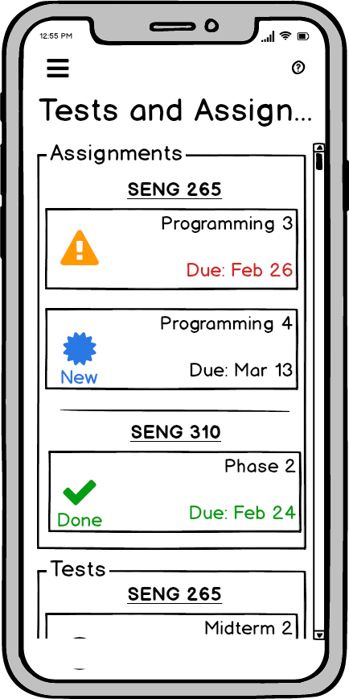

### Behavior (Part 1)

This space lets students know what assignments they are currently assigned, and what tests to keep an eye out for. 

Each assignment is shown underneath the name of the course it corresponds to.
New assignments, when posted by the instructor, are automatically visible on this page, and marked with a blue star.
Assignments that are close to their due date have a yellow warning symbol next to them with the due date in red text.

At any time, the student can click on the symbol next to the assignment at this menu and mark it as done. It’s up to them to be honest. They can also revert an assignment marked as “done” back to “not done” 

Contribution: Brendan Ciccone
 <a href = "#top">[top]</a>
&nbsp; 
&nbsp; 

### Low Fidelity Prototype (Part 2)

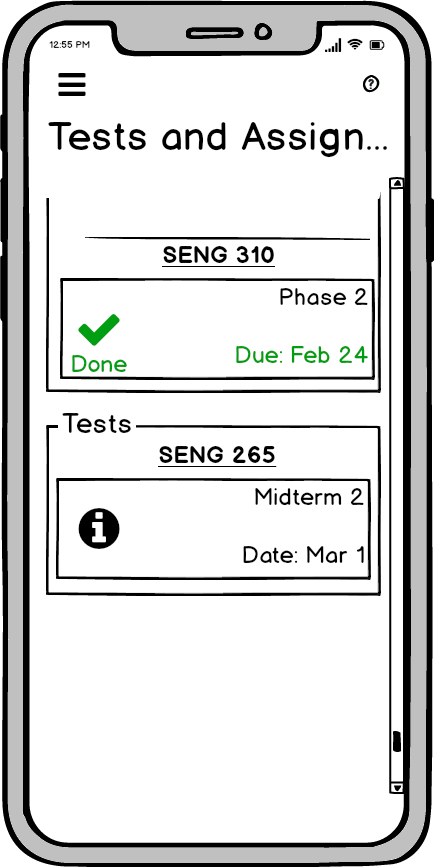

### Behavior (Part 2)
The tests are below this category, and show when the test is taking place on.
Each test or assignment can be clicked on to expand its details.

Contribution: Brendan Ciccone
 <a href = "#top">[top]</a>
&nbsp; 
&nbsp; 

### Low Fidelity Prototype (Part 3)

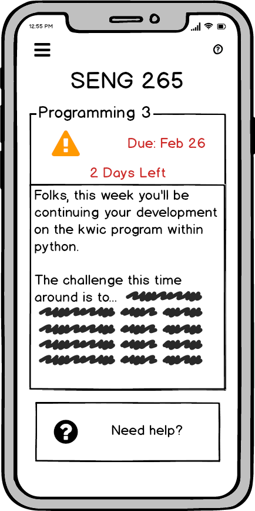

### Behavior (Part 3)
Inside assignment details are more information about how the student should go about doing the assignment. These notes are provided by the instructor. Below these notes is a button that can provide a link to help. It will direct them study tips and tricks, and show tips relevant to assignments.

Contribution: Brendan Ciccone
 <a href = "#top">[top]</a>
&nbsp; 
&nbsp; 

### Low Fidelity Prototype (Part 4)

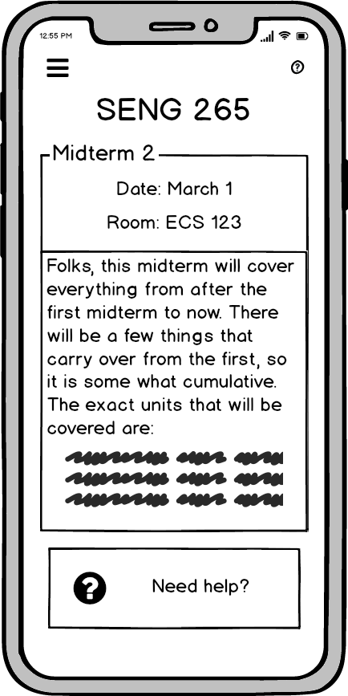

### Behavior (Part 4)
Inside test details are more information about the test material, and where the test will be held. This is all provided by the instructor. Below these notes is a button that can provide a link to help. It will direct them study tips and tricks, and show tips relevant to preparing for tests.

Contribution: Brendan Ciccone

<a href = "#top">[top]</a>

&nbsp; 
&nbsp; 

## Assignment Alarm

### Low Fidelity Prototype

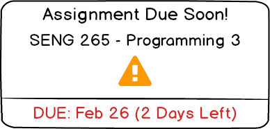

### Behavior
If a test or assignment is nearing its due date, an alert will appear on the users phone that tells them which assignment or test is drawing near.

Contribution: Brendan Ciccone

<a href = "#top">[top]</a>

&nbsp; 
&nbsp; 

## Study Tips and Tricks

### Low Fidelity Prototype

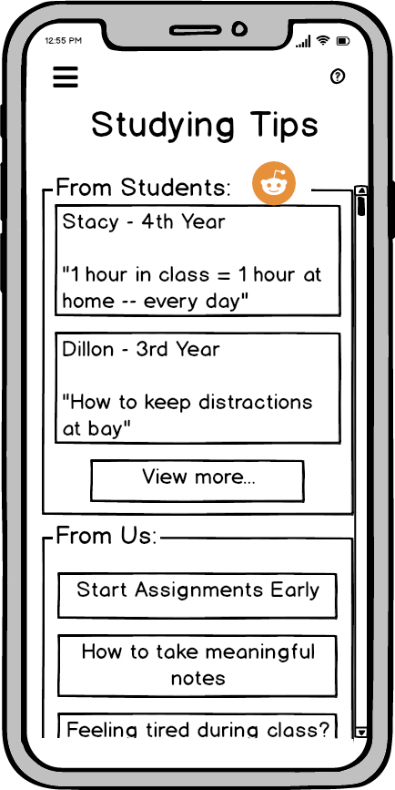
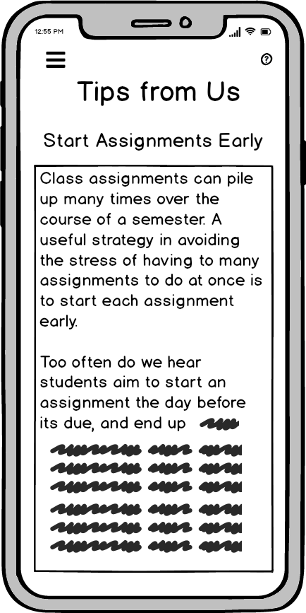

### Behavior
This space offers students the option to seek help in their academic endeavors from tips provided by students and Earl Technologies. 

Student tips are sourced from a Reddit page. Few of the top rated ones are shown, each with the name of the student, their year of study, and the topic of their advice. Students can click on the Tips they see in this box or click View More to enter the reddit page and see more of the tips posted there.

Below that are tips that Earl Technologies has created based on the professional advice of successful instructors and students. Clicking on any of those will take the student to a more detailed screen where the advice is given.

Contribution: Brendan Ciccone

<a href = "#top">[top]</a>

&nbsp; 
&nbsp; 

## Checklists and Todolists

### Low Fidelity Prototype

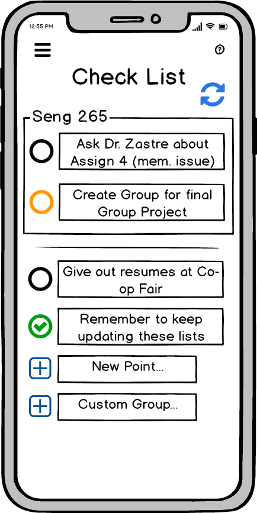
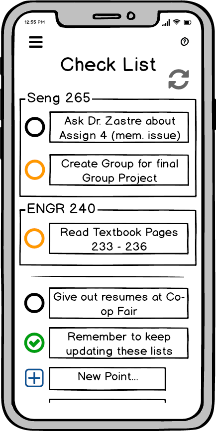
 

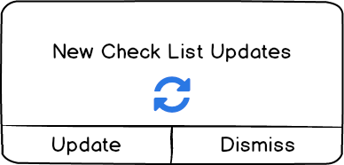

### Behavior
The checklist space provides a list a student can use to keep track of things they need to do with regards to each class they are taking, or other miscellaneous tasks.

The yellow circles indicate tasks that an instructor recommends students to complete. Instructors of classes can create recommended tasks for students to do, and have the application send that task to the students lists.

If any instructor has sent a new task for a student to view, they will be sent and alert. The student can choose whether or not to update their list.

The black circles are tasks that the student has made themselves. They can be inside a specific course group, outside any course group, or fitted into custom groups the student can define.

Contribution: Brendan Ciccone

<a href = "#top">[top]</a>

&nbsp; 

---

&nbsp; 

## Maps

### Design Decisions and Rationale
The unique thing about this feature is that it only requires a mapping database within the school’s campus. The mapping feature will only provide navigations features which encompass the campus area, further increasing its processing and generation speed. The “Map” allows users to input their location or press an arrow icon which automatically logs their coordinate and updates their destination; the appplication generates the best way to get to a location, estimates the distance, and provides an expected time of arrival.

### Requirement from Phase 1
Based on a Phase 1<a href = "../content/phase1/2019-02-19-userreqs.html" target = "_blank">User Requirements - Student - Paragraph 4 </a>, we designed this function to help new students, teachers or staff members optimize their traversal of the campus with just a press of a button, thus fulfilling the requirement stated.

### Low Fidelity Prototype

### Behavior
There are 2 sub components that make this “Map” unique, convenient, and extremely helpful for students. The first one is the “Pin” function (The pin symbol below the search bar in the prototype) can be pressed after the application has generated a path to a destination in order to save that path and destination for another mapping session. A user can customize the color of the pin to distinguish different destinations. For example, for the next mapping session, the user can just press the saved pin symbol on the map and it will automatically generate a path from their current location to the saved destination. The data generated by the mapping function will be linked to the users weekly time table, so that all of the users courses classroom locations within the relevant semester will be pinned to the map. These auto generated pins will come with the option ”View on map” in the within the <a href = "#weekly_timetable">Weekly Timetable</a> section.

The second sub-function is the calendar symbol, which allows a user to jump between the map and the Weekly Timetable; students can check their other classes on the same day, and can easily find a route to get to the next class quite easily.

Contribution: Alex Nguyen

<a href = "#top">[top]</a>

&nbsp; 

---

&nbsp; 

## School Events

### Design Decisions and Rationale
With this component By doing this, not only can we assist users with study, but we can also provide them with an overview about what happens on campus. This includes whatever event might be deemed useful for them. This also includes contests, events, and academic projects.

### Requirement from Phase 1
### Low Fidelity Prototype

### Behavior
All news and events that occur around campus on a particular day will be uploaded to new and events database as soon as possible. The application will be updated based on changes in that database whenever the user queries this section. On the main screen "School Events", there will only exist headlines and summaries. When a user taps the button "Read more" the headline or summary will be expanded so that the full article can be read.

This feature will be linked to a students course schedule in order to filter our and prioritize news or events that are relevant to their current coarse schedule and their major.

A notification system will be accessible from the upper right corner of the screen which shows the user how many news articles they haven't yet read. At the bottom of the screen there will be an option available called "View Older News" which will allow a user to view older news and events entries.

Contribution: Alex Nguyen

<a href = "#top">[top]</a>

&nbsp; 

---

&nbsp; 

## Find My Prof

### Design Decisions and Rationale
For the “Find My Professor Contact Information and Office Hours” model, we are utilizing the very common design pattern of text box entry and button press. This is a very simple page so the design doesn't necessarily fit a specific interface metaphor, nor is it inspired from another design specifically. However, this is intuitively a common user interface design pattern about which most users have intuitive knowledge and an implicit understanding. The widgets utilized in this section are a hamburger style menu button, search buttons, text entry buttons.

### Requirement from Phase 1
A requirement from Phase 1 user profile for “Bob” states that he likes to make weekly schedules: <a href = "../content/phase1/2019-02-19-userprofiles.html" target = "_blank">Phase 1: Paragraph 1 - "Bob(Student)"</a>. Meeting this requirement requires the user to become aware of their professors office hours, location, and contact information. This component and it's children component (Results) covers, in part, the requirement by providing Bob with such information.

### Low Fidelity Prototype

### Behavior
To begin, a user would have navigated here from the main menu button “Find My Prof”. Once on the page, the user will notice two text fields. One for the school name, and one for the professor name. The student will also notice the main menu hamburger button on the top left. And finally, a “search” button will be visible at the bottom of the screen under both text entry fields. The search button will not be clickable since both text fields are empty. The button only becomes active once there is text in both fields.

A user should be able to click on the text-box to enter a their school name. A software keyboard will pop up from the bottom of the screen after the user clicks the text field. While they are typing in the school name, a background search of possible matches will be taking place, presenting the student with known options that best match what they have typed in so far. A user should be able to select from one of the options that pop up in the matched box, or should be able to press the keyboard enter button to exit the text entry, preserving the text saved so far so that they can move on to entering text in the professor’s name field.

The professor’s name field should behave in a similar manner to the school name field. Should a matching name exist in the database for that school and professor, an option will pop up allowing the student to select from matches so far. If that professor doesn’t exist, or a match cannot be found based on the field, the user can press enter which will allow the user to exit from the text entry. Once exited, the search button at the bottom of the screen will become active.

The user should be able to click the search button, and the application will then display a waiting icon of some kind, after which the results screen will pop up. The results screen will simply consist of two text boxes which display any found information about the professor at that school. The user has the option to click the “search again” button, which will take the user back to the previous screen. There is also the option of clicking the main hamburger button menu at the top left.

Contribution: Alex Deweert

<a href = "#top">[top]</a>

&nbsp; 

---

&nbsp; 

## Professor Contact and Office Hours
### Design Decisions and Rationale
Here we have an extremely simple results display section. The design of this component was quite simply inspired by the ability to view separate pieces of information on the same page without the user being confused about where the informaiton was separated or not. The design looks like two post-it notes, which might be a basic interface metaphor.

The widgets utilized in this section are, of course, the menu icon on the top left, clickable buttons, and a text display results window that a user may highlight and copy.

### Requirement from Phase 1
A requirement from Phase 1 user profile for “Bob” states that he likes to make weekly schedules: <a href = "../content/phase1/2019-02-19-userprofiles.html" target = "_blank">Phase 1: Paragraph 1 - "Bob(Student)"</a>. Meeting this requirement requires the user to become aware of their professors office hours, location, and contact information. This component and it's parent component (FindMyProf) covers, in part, the requirement by providing Bob with such information.

### Low Fidelity Prototype

### Behavior
The menu in the top left corner, when clicked, should slide out the main navigation menu that should display the main menu with submenus, similar to the <a href = "#top">"hierarchical overview"</a> section above. The two text boxes display results information of the FindMyProf search results on the parent component. The results text boxes will display information as depicted in the prototype. The text in those boxes will be clickable, and copy-able. A button on the bottom screen, if clicked, will take a user back to the FindMyProf parent component.

Contribution: Alex Deweert

<a href = "#top">[top]</a>

&nbsp; 

---

&nbsp; 

## Professor Ratings
### Design Decisions and Rationale
The design of this portion was inspired by an amalgamation of two popular websites, Reddit.com and RateMyProfessor.com. Reddit has a popular upvote and downvote system in order for the user community to validate eachothers commenting. RateMyProfessor allows students to make informed decisions on what to expect when signing up for a course with a particular professor.

The interface metaphors for this portion of the design include: the well known hamburger menu visible at the top left of the screen, the upvote and downvote system for forum based websites or mobile applications, and the list result sorting system common with many applications based on search results. All of these designs are based on well known applications such as Reddit, for the upvote and downvote system. The metaphor here is that of the diplomatic voting system. The menu widget and sorting widget are just common design patterns.

Widgets will include clickable buttons, search boxes, scrollable results sections, a list sorting option menu, upvote and downvote buttons for list items.

### Requirement from Phase 1
Based on Phase 1 requirement, “*a parent would like to have access to course reviews, professor reviews, and past course averages to ensure that child-students get the best education possible*” under <a href = "../content/phase1/2019-02-19-usabilitygoals.html" target = "_blank">Phase 1: Usability Goals - Paragraph 3 - Subparagraph 5</a>, this components meets the requirement by allowing a user to search for professor information. The user is then presented with a results page that can be sorted. The user can enter a new review, or create an entry for a professor that is not yet located within the database. Not only would parent benefit from this feature (per the Phase 1 requirement) but clearly, this component has students in mind. Although this requirement was not specifically mentioned in Phase 1, it is certainly implied.

### Low Fidelity Prototype

### Behavior
The design will allow a user to search the professor name and school, the result set will be displayed first by an average rating, and the mode of professor characteristics. For example, tough marker, tough assignments, takes attendance, easy tests, hard tests, would take again, etc. A list of chronologically sorted ratings based on most recent first will also be displayed. All list results will be presented within a scrollable portion of the screen, with buttons for sorting on top, or a rating submission on top as well.
Each list entry will contain a rating value from between 1-5, a comments section, a checkbox section indicating which characteristics of that professor were selected.

Each list entry will contain an agreement/disagreement rating system. That way, reviews which do not reflect the opinion of other students can be disregarded as a less-common / inaccurate representation. If a user clicks the "up" arrow on any of the comments, the count will be incremented by one. If the user clicks the "down" arrow, the count will be decremented by one. The count can be any value in the range of [-MAX_INT, +MAX_INT].

Buttons at the top of the list will include: sort by button with a “sort” label. The options under a pop-up menu will include sorting options such as number of ratings, most agreements, most disagreements, course type, or date. A user who clicks this button will see a sort menu brought into focus and slide down from the button. The widgets and background behind the menu will slightly fade out with a transparent grey overlay, focusing the users attention on the pop-down menu. The user can select from one of the options, and the results list will be sorted according to that option.

Although not displayed on the prototype, a button will be available for a student to click titled "Post a Rating". This button will be in the bottom middle of the screen, just above the "Search Again" back button. If clicked, this button will bring a student to a new page. The new page will contain a 
"comments" text field in the middle of the screen. Above that text box will be checkboxes that contain "tags". These tags are common attributes that are characteristic of the users experince with that particular prof. A "course taken" text field will be below the "tags" portion. This text field will contain the course number that the student had taken with that professor and on what date. There will also be a button with an uparrow and downarrow that, when clicked, will change a displayed "Rating" value to values between 1-5 in increments of 0.1. Finally, at the bottom of the screen, there will be a submit button. BEFORE SUBMITTING: The sytem MUST check to ensure that the user in question had in fact taken the course with that professor, in a time period in the past. In that way, the system avoids the ratings sytem to be overwhelmed with "troll" ratings.

Contribution: Alex Deweert

<a href = "#top">[top]</a>

&nbsp; 

---

&nbsp; 

## Student Finances

### Design Decisions and Rationale
This component was designed with a central payment and finances hub in mind, similar to that of a mobile banking application. A quick-view text box widget will display a useful summary of user finances. The user would have access to all other Student Finances components from this central view. For that, we included four buttons at the bottom for navigation.

### Requirement from Phase 1
Based on a requirement, “*a user will be able to manage their payments to the University*”, <a href = "../content/phase1/2019-02-14-introduction.html" target = "_blank">Phase 1: Introduction - Paragraph 1 last sentence</a>, the requirement implies that a student will have control over financial accounts that are linked to UVic, including tuition, and Onecard (or similar service in the case where the app isn’t at UVic). Here we show how the requirement for a payment and account utility is met by this component, and its child components "Tution and Account Balance", "ONECard Account", "Link Bank Account", and "Make Payment".

### Low Fidelity Prototype

### Behavior
The top left menu button will behave in a similar manner to the other sections. The top right help button, the question mark icon, will change make it so subsequent clicks on the other components of the user interface in this section display text which describes its functionality: if the Quickview text area is clicked then display "A summary of user finances"; if the buttons are clicked then display text which describes the function of the page that clicking the button will take the user to. The bottom buttons will be organized in a manner similar to what is observable in the prototype. A back button on the botto middle will navigate the user back to the parent component, which is the home screen.

Contribution: Alex Deweert

<a href = "#top">[top]</a>

&nbsp; 

---

&nbsp; 

## Tuition and Account Balance

### Design Decisions and Rationale
The navigation buttons on the bottom of this screen will persist between the parent component "Student Finances" (User Finances on the prototype), and the sibling component "ONECard Account". The decision here was made in order to enhance the central payment and finances hub feeling, similar to a mobile banking application. In those applications we see a persistence of commonly used navigation buttons, especially when jumping between screens to update amounts to deposit, or amounts to pay. The widgets in this section include all of the buttons mentioned in the parent component, and an information text field, but with the included pop down menu at the bottom of the informations screen. This is visible in the prototype.

### Low Fidelity Prototype

### Behavior
The top left menu bar, and top right help buttons behave in a similar manner to that of the parent component. Except the help button tooltip clicks will display: for the "Tuition Statement" section "Details of your UVic (or similar) tuition account"; for the "change term" button at the bottom of the Tuition Statement text field "Select the term from which to display your tuition payments summary"; for the bottom four navigation buttons, display to the user the function of the page to which the user would be taken to if the button was clicked. The buttons take the user to the component described on the button text, which is self explanatory. Finally, the back button takes the user to the parent component.

Contribution: Alex Deweert

<a href = "#top">[top]</a>

&nbsp; 

---

&nbsp; 

## ONECard Account (or similar)

### Design Decisions and Rationale
The design of this section was very similar to the parent component "Student Finances" (or User Finances in the prototype). The interface metaphors and widgets are nearly identical. The only difference is that the information displayed in the central text box is different.

### Low Fidelity Prototype

### Behavior
The only ways that this component screen differs in behavior from that of the parent component, is that the text box tooltip information for the help button changes the message displayed to the user as "Displays the most recent user activity for your one card account, including all recent transactions, deposits, and withdrawals and details like date and time of the transaction". The text in this box can be clicked, hightlighted, and copied. The button "ONECard Account" will not be inactive and unclickable since the user is already navigated to this section. Other than that, the behavior is similar to the parent component.

Contribution: Alex Deweert

<a href = "#top">[top]</a>

&nbsp; 

---

&nbsp; 

## Link Bank Account

### Design Decisions and Rationale
Although this component is a child of the Student Finances parent component, which acts as a central hub similar to a mobile application banking experience, this page moves away from that motivation slightly. Since this page is specifically for linking an outside bank account, we wanted to give the user a sense that the bank account linking was being done on an outside account. This decision serves to highlight the fact that linking an outside bank account to a 3rd party application such as CalendarCompanion is a potential security risk. The design of this page is similar to that of many bank account linking interfaces, common in many payment applications.

### Low Fidelity Prototype

### Behavior
The top left menu functions in a similar way to the parent and sibling components. The help button tooltips will display: for "Choose Financial Institution" pop down menu "Pick a bank account in which you have an active account with funds in it"; for the icon below the pop down menu "this is an icon that displays the logo of your chosen financial institution"; for the "Account Number" text field "This is the account number that you use to log in to online banking, please contact your financial institution to obtain this number"; for the "password" text field "this is the password you use to log in to your online banking - CalendarCompanio does not store this information on it's database! A CalendarCompanion employee would never ask you for this information"; for the "Link" button "By clicking this you agree to log in to your chosen financial institution and allow CalendarCompanion application to withdraw funds with your permission".

When a uesr clicks on "Choose Financial Institution" button, a pop down menu displays to user a list of links that they can click on to select their financial institution of choice. Once selected, a logo for that bank will be displayed. The users decision will be cached for future use, but not their password. A user cannot click the "Link" button unless both Account Number and Password fields are filled in. Once clicked, the Link button will begin the bank account linking process [this might require special set up and permissions from the financial institution or third party banking libraries or API]. The labels and widget positioning will be in a manner that conforms to the prototype.

Contribution: Alex Deweert

<a href = "#top">[top]</a>

&nbsp; 

---

&nbsp; 

## Make Payment

### Design Decisions and Rationale
The most important feature for this component was to draw attention to the users balance. For that, the "Balance" widget, which is a small text field, will display the current tuition and fees balance in large red text. This component does not follow a specific interface metaphor, nor does it draw inspiration from any particular source. The widgets used are pop down menus, buttons, and text fields.

### Low Fidelity Prototype

### Behavior
The help button tooltip will display: for the top left pop down menu "the semester from which you would like to see your account balance"; for the "pay with" pop down menu "the account from which any payments made will be withdrawn".

Once a user clicks the Pay With option, and fills in an amount to pay (not shown on prototype), then the "Pay" button will become active in the bottom middle of the screen. When the user clicks the button, a confirmation dialog will pop up asking the user if they wish to continue. Should the user click yes continue, the results of the payment will be displayed in the text field at the bottom of the screen (per the prototype). The receipt text field will be clickable and highlightable as well.

When a user clicks the pop down menu (at top left) to select the semester, the fields Balance and Last Payment will be updated with information from that semseter. Even historial data can be viewed. Finally, the back button will take the user to the Student Finances parent component.

Contribution: Alex Deweert

<a href = "#top">[top]</a>

&nbsp; 

---

&nbsp; 

## User Account

### Requirement from Phase 1
To have access to a user account was not an explicit requirement in Phase 1. However, for another requirement: <a href = "../content/phase1/2019-02-19-userreqs.html" target = "_blank">User Requirements, Student, Paragraph 6</a>; "*CalendarCompanion will be available in multiple languages.*" this section fulfills the requirement.

### Design Decisions and Rationale
The design for user account information was modeled after what was already present on the UVic website, with a few tweaks for extra information based on the fact that we're using a 3rd party application with it's own account housekeeping and data storage. The account information is separated into four components "Summary", "Personal", "Account", and "Preferences" but in a tab-like widget fashion in order to give the user a sense that they are not navigating away from the User Account parent component.

### Requirement from Phase 1

### Low Fidelity Prototype

### Behavior
The layout will be exactly as depicted in the prototype for each portion. Each tab, when clicked, will bring the user to the appropriate section. The Summary tab will display information the other three tabs. The information here will be compacted. The personal tab will display a users tombstone data such as name, preferred name, email, and SIN number (the SIN number requirement might be changed in future design because it doesn't seem necessary except for employment and tax purposes). On every tab, a user can click "update information" and then "save" once that information has been updated in order to commit the changes. The update information buttons, when clicked, will make the displayed fields turn into text entry fields populated with the current value. Once save is clicked, that data is placed back into text field form, and the data commited to the CalendarCompanion and UVic (or similar) database provided there is no conflict with the insertion. The preferences tab will allow a user to choose the CalendarCompanion color scheme, and notification options. There will be a default button which, if clicked, will update the users preferences to the factory default scheme and notification options.

A language selector (not seen in the prototype) will allow a user to change the language settings of the application by clicking a language drop down menu. Although, during first initialization of the program after start up, the applicaiton should make every effort to alter the language settings automatically based on user region or phone system environment variables already pre-established.

Contribution: Alex Deweert

<a href = "#top">[top]</a>

&nbsp; 

---

&nbsp; 

## Help

Due to the detail and extent of this portion of the application, the following section has been compiled into an external document. Please see the following external link for details regarding this section:

<a href = "https://github.com/AlexDeweert/seng310_earltech/blob/master/Appendix_A.pdf" target = "_blank">Primary Link: Appendix "A" </a> 
<a href = "https://drive.google.com/open?id=1IinoIerKQzgPTetNFFd983miKoIV7giP" target = "_blank">Alternate Link: Appendix "A" </a> 
Contribution: Daniel Dubichev

<a href = "#top">[top]</a>

&nbsp; 

---

&nbsp; 

## Calendar Companion Tutorial

### Design Decisions and Rationale
The inspiration for this section is based on common "tutorial" sections common in many applications. Also, if one recalls the Microsoft "Clippy" help and tutorial mascot, this tutorial component has a similar style, except without the mascot. Although Clippy was seen as annoying, his essential function is necessary to new and computer illiterate users. The widgets used are dimming overlays for when the tutorial is activated, and text bubble boxes which point to widgets in focus.

### Low Fidelity Prototype

### Behavior
Within the Tutorial subcomponent of Help, a user will click a labeled and pre-sripted tutorial link. For example, "Tutorial: How to use the Tuition and Account Balance" section. A user would click a link, which is from a list of pre-compiled and pre-scripted tutorial links on that page (not shown in the prototype - but it's a simple list with a back button, and the top left hamburger menu and top right help button, but that's it, very simply designed). Once the tutorial link is clicked, the applicaiton will automatically navigate the user to the page upon which the tutorial is based. A bubble box will appear over a widget, button, or text entry field, telling the user what to do next. Once the user has fulfilled the task that the bubble box is telling a user to do, the tutorial will move on to the next step, repeating the process until all tutorial steps are completed. Any non-relevant widgets or components that are not the focus of the tutorial will have a transparent grey overlay in order to draw the users attention to the item of relevance.

Contribution: Alex Deweert

<a href = "#top">[top]</a>

