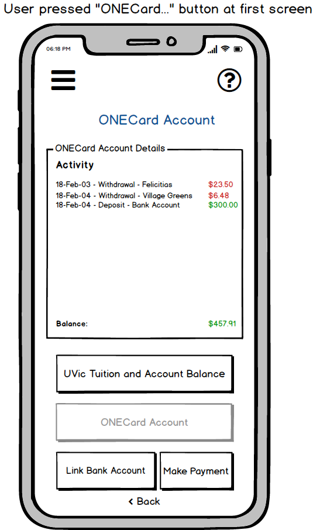

# Phase 2: Design

&nbsp;&nbsp;&nbsp;&nbsp;Welcome to the design portion of the CalendarCompanion application. Here we will discuss the design details surrounding a mobile implementation of Calendar Companion. We will provide design decisions, details, and prototypes.

&nbsp;&nbsp;&nbsp;&nbsp;This document serves to provide an overview of the design phase of the CalendarCompanion application. We will first provide a high level hierarchical overview and short description of each component in our design proposal. Next, each component will be be described in detail; each section will include a design decision rationale for the component in question (interface metaphors, widget choices, etc), plus how that portion of the design fulfills a requirement based on data gathered in Phase 1. Finally, each component section will include a low fidelity prototype, and a detailed description of the behavior of each component widget.

&nbsp;&nbsp;&nbsp;&nbsp;Using this document, a developer should be provided with enough detail that the application could be made with little to no additional guidance from the designers of the application. The Earl Technologies team is please to present the CalendarCompanion prototype and design document.
<!-- Design Desicion and Rationale
Requirement from Phase 1
Low Fidelity Prototype
Behavior -->

&nbsp; 

---

&nbsp; 
&nbsp; 
&nbsp; 

    <b>University of Victoria 
    SENG 310 Winter 2019 
    Prof. G. Tzanetakis  </b>
    &nbsp; 
    <b>Alex Nguyen:</b> V00894486 
    <b>Brendan Ciccone:</b> V00871008 
    <b>Daniel Dubichev:</b> V0877776 
    <b>Alex Deweert:</b> V00855767 
&nbsp; 
&nbsp; 
    
        <b>Phase 2: Design</b>
         
        <b>Calendar Companion</b>
    

&nbsp; 
&nbsp; 

# Contents

<ol>
  <li><a href = "#high_level_overview">Hierarchical overview</a></li>
  <li><a href = "#details">Details</a></li>
    <ol>
        <li><a href = "#login_page">Login Page</a></li>
        <li><a href = "#course_schedule">Course Schedule</a></li>
            <ol style = "list-style-type: upper-alpha">
                <li><a href = "#future_courses">Future Courses</a></li>
                <li><a href = "#weekly_timetable">Weekly Timetable</a></li>
                <li><a href = "#create_a_degree_map">Create a Degree Map</a></li>
                <li><a href = "#my_degree_maps">My Degree Maps</a></li>
            </ol>
        <li><a href = "#study_assistant">Study Assistant</a></li>
            <ol style = "list-style-type: upper-alpha">
                <li><a href = "#assignment_alarm">Assignment Alarm</a></li>
                <li><a href = "#study_tips_and_tricks">Study Tips and Tricks</a></li>
                <li><a href = "#test_reminders">Test Reminder</a></li>
                <li><a href = "#todo_check_list">Todo/Check List</a></li>
            </ol>
        <li><a href = "#map">Map</a></li>
        <li><a href = "#school_events">School Events</a></li>
        <li><a href = "#find_my_prof">Find My Prof</a></li>
            <ol style = "list-style-type: upper-alpha">
                <li><a href = "#contact_info_and_office_hours">Contact Info and Office Hours</a></li>
                <li><a href = "#professor_ratings">Professor Ratings</a></li>
            </ol>
        <li><a href = "#student_finances">Student Finances</a></li>
            <ol style = "list-style-type: upper-alpha">
                <li><a href = "#tuition_and_account_balance">Tution and Bank Account</a></li>
                <li><a href = "#one_card_account">One Card Account</a></li>
                <li><a href = "#link_bank_account">Link Bank Account</a></li>
                <li><a href = "#make_payment">Make Payment</a></li>
            </ol>
        <li><a href = "#user_account">User Account</a></li>
        <li><a href = "#help">Help</a></li>
            <ol style = "list-style-type: upper-alpha">
                <li><a href = "#calendar_companion_tutorial">CalendarCompanion Tutorial</a></li>
            </ol>
    </ol>
</ol>
&nbsp; 
&nbsp; 

---

&nbsp; 
&nbsp; 

# Hierarchical overview

<ol>
    <li><a href = "#login_page">Login Page</a>
         This is a standard login page that will display a CalendarCompanion logo. This page is allows a user to enter a netlink (or similar) ID, and their password. This page will display standard options typical in a mobile application login page; options such as forgot password, forgot account name, remember me, signup, etc. A successful sign in here will direct the user the application home page that contains links to course schedule, study assistant, map, school events, find my prof, student finances, user account, and help. All interaction in this application is done via touch screen interaction. <a href = "#top">[top]</a>
    </li>
    &nbsp; 
    <li><a href = "#course_schedule">Course Schedule</a>
         This page acts as a parent to other sections related to scheduling. This page will be home to four submenus. Underneath each submenu will be a subtitle which explains what it's use is. In addition, students may scroll down to see to see all submenus in cases where they menus do not fit on the device screen. <a href = "#top">[top]</a>
        </li>
        &nbsp; 
        <ol style = "list-style-type: upper-alpha">
            <li><a href = "#future_courses">Future Courses</a>
             The Future Courses tool allows a student to view courses offered in a specific year and session (Fall, Spring, Summer). This is useful for the degree map creation, as one can quickly and easily view courses offered in the future.
            </li>
            &nbsp; 
            <li><a href = "#weekly_timetable">Weekly Timetable</a>
             The Weekly Timetable tool allows the user to see the current semester weekly schedule. From Monday to Friday, the Weekly Timetable will import scheduled courses/labs for the user based on the UVic (or other) database, and will display all corresponding locations, times, and professors.
            </li>
            &nbsp; 
            <li><a href = "#create_a_degree_map">Create a Degree Map</a>
             A user can create a degree map which helps the user to stay organized and in control of their University experience. The user may receive email or text notifications just prior to course registration openings. The user may also sign up for a course according to their degree map session and year, expediting their graduation time.
            </li>
            &nbsp; 
            <li><a href = "#my_degree_maps">My Degree Maps</a>
             This section affords a user the ability to create and view a map of their degree. In other words, a map is a sequence of courses that a student must take in order to reach the desired degree graduation goal.
            &nbsp; 
            </li>
        </ol>
    <li><a href = "#study_assistant">Study Assistant</a>
     The Study Assistant page is parent to all components that are related to what a user might expect to find in a typical study assistant application. Such components as alarms, tips an tricks, reminders, and checklists are submenus to this page. <a href = "#top">[top]</a>
    </li>
    &nbsp; 
        <ol style = "list-style-type: upper-alpha">
            <li><a href = "#assignment_alarm">Assignment Alarm</a>
              TODO: Brendan
            </li>
            &nbsp; 
            <li><a href = "#study_tips_and_tricks">Study Tips and Tricks</a>
              TODO: Brendan
            </li>
            &nbsp; 
            <li><a href = "#test_reminders">Test Reminder</a>
              TODO: Brendan
            </li>
            &nbsp; 
            <li><a href = "#todo_check_list">Todo/Check List</a>
              TODO: Brendan
            </li>
            &nbsp; 
        </ol>
    <li><a href = "#map">Map</a>
     One of the most significant features of the CalendarCompanion application is campus map navigation. This section is navigated to based on the main menu item “Map”. It can also be selected from “Find Class Room” in the “Course Schedule” section, or by requesting it from the Virutal Assistant. <a href = "#top">[top]</a>
    </li>
    &nbsp; 
    <li><a href = "#school_events">School Events</a>
     One of the factors that greatly affect a student's performance at university is their social life. Moreover, social development at this stage is a student's life is key to their success in the workplace. This part of the application keeps a student apprised of up-to-date news around campus. In this feature, all academic events, social events, and campus news are uploaded to the student's School Events feed everyday. <a href = "#top">[top]</a>
    </li>
    &nbsp; 
    <li><a href = "#find_my_prof">Find My Prof</a>
     Here we have the Find My Prof section which allows a student to search a professor by name and by institution. This section acts as a parent to two other sections. The results of a search on this page can be utilized in the child sections "Contact Info and Office Hours" and "Professor Ratings". <a href = "#top">[top]</a>
    </li>
    &nbsp; 
        <ol style = "list-style-type: upper-alpha">
            <li><a href = "#contact_info_and_office_hours">Contact Info and Office Hours</a>
             Here we have the “Find Professor Contact Information and Office Hours” section of the application. This section is navigated to based on the main menu item “Find My Prof”. This section can also be gotten to based on a suggestion from the Virtual Assistant. This is basically the results page of a professor search based on the parent section, "Find My Prof".
            </li>
            &nbsp; 
            <li><a href = "#professor_ratings">Professor Ratings</a>
             This is another child component under the "Find My Prof" section. This section allows a user to view all professor ratings based off of the search results from Find My Prof. A list of professor ratings are present in this section, and can be sorted by list entry detail. For example, if every list entry contains an entry-rating (other students can agree or disagree with the professor rating), a course number, a grade provided, a user can organize the list based on those details.
            </li>
            &nbsp; 
        </ol>
    <li><a href = "#student_finances">Student Finances</a>
     For this portion of the application, the student may view financial information such as outstanding tuition payments, current personal account balance, linking a bank account to the personal CaldenarCompanion account, or depositing funds into the CalendarCompanion account with a credit card. <a href = "#top">[top]</a>
    </li>
    &nbsp; 
    <ol style = "list-style-type: upper-alpha">
            <li><a href = "#tuition_and_account_balance">Tuition and Account Balance</a>
              This component is a child to Student Finances, and it allows a user to view a quick summary of their tution account, included balances and recent payments. In addition, the student may view balances of linked bank accounts or ONECard (or similar) accounts.
            </li>
            &nbsp; 
            <li><a href = "#one_card_account">ONECard Account (or similar)</a>
              Here is a detailed summary of a users ONECard account. This view allows a user to observe the current balance, the last tranasaction made including where and when, and also allows deposits to be made via linked bank account or a credit card.
            </li>
            &nbsp; 
            <li><a href = "#link_bank_account">Link Bank Account</a>
              Here a user may link an outside financial institution to their CalendarCompanion account so that tuition payments can be made directly from the users bank. In addition, a linked bank account can be used to fund a ONECard account.
            </li>
            &nbsp; 
            <li><a href = "#make_payment">Make Payment</a>
              In this component, we see an interface to a university's tuition payment system. This view shows current balance, last amount paid. It allows a user to choose to account from which to make a payment. Following a payment transaction, a user will observe a receipt which they can e-mail or print. <b>//TODO add e-mail & print button to payment mockup</b>
            </li>
            &nbsp; 
        </ol>
    <li><a href = "#user_account">User Account</a>
     Here we have the CalendarCompanion user account component. This page is parent to four tabs, which are subcategories of the User Account: personal information, account information, and preferences. The User Account is a central location for CalendarCompanion account information, UVic (or other school) account information, and CalendarCompanion application preferences. <a href = "#top">[top]</a>
    </li>
    &nbsp; 
    <li><a href = "#help">Help</a>
     In case a user requires any assistance, CalendarCompanion has it covered. The help section is home to section definitions, frequently asked questions, reporting bugs, and parent to a tutorial section. <a href = "#top">[top]</a>
    </li>
    &nbsp; 
        <ol style = "list-style-type: upper-alpha">
            <li><a href = "#calendar_companion_tutorial">CalendarCompanion Tutorial</a>
             In this section, a user can select from a list of tutorials for the most common sequence of actions that a user might take while utilizing CalendarCompanion. The tutorial section is based on a step-by-step walkthrough style approach where a user would tap buttons and complete actions along the way while a tutorial bubble or arrow system tells them what to do next and why.
            </li>
            &nbsp; 
        </ol>
</ol>

&nbsp; 
&nbsp; 

---

&nbsp; 
&nbsp; 

<!-- Design Decisions and Rationale
Requirement from Phase 1
Low Fidelity Prototype
Behavior -->

# Design Details and Specifics

## Login Page

### Design Decisions and Rationale
&nbsp;&nbsp;&nbsp;&nbsp;The design of the login page was fairly straightforward. It's best to take advantage of the most common login page layout since most people are familar with these kinds of pages given the influx of mobile applications that require accounts in recent years. The decision to include sections such as "forgot password", "remember me", "sign up" was an easy one. These design patterns are helpful and well known. 

### Requirement from Phase 1
&nbsp;&nbsp;&nbsp;&nbsp;This is an implicit requirement from Phase 1. For any users to interact with a mobile application that requires specific knowledge and recordkeeping for one student, the requirement for a login page was not a question. This requirement is met in our design.

### Low Fidelity Prototype

### Behavior
The CalendarCompanion application is displayed as a splash screen while the applicaiton is loading. Once loaded, ”Welcome to CalendarCompanion, please log in!” is displayed to the user. The user is provided with two text boxes into which they will add their netlink id and password. This is done via software keyboard that pops up when a user clicks the field. A "Remember Me" checkbox below the id and password fields is available so that a user does not have to keep filling in the information after they log out or the session expires and the application is restarted.

One of two things will happen after a use attempts to log in with credntials. In both cases, a dialog box will pop up telling user either that "this device will be trusted so that future logins are not required" or "credentials not recognized, redirecting to account creation page" at which point the user will be directed to an external site, which will be the sign up page on the UVic (or similar) website.

This rederiction will open the preffered browser of your phone system. For example, Chrome or Safari.

A "Create Account" button will be visible at the bottom of the login screen, which will lead a user who clicks it to the the "Create Account" page. Once on the create account page, the user will have see the "Virtual Assistant" AI chat bot on a bottom portion of the screen. There will be a "forgot your password" link as well, which will lead them to a password recovery screen. 

Once logged in successfully, a user will be directed to the home screen which is a parent screen that displays all of the main options for the user. These options are available as buttons with descriptions, and are detailed in the following sections.

<a href = "#top">[top]</a>

&nbsp; 

## Course Schedule
### Design Decisions and Rationale
This is simply a landing page that one is directed to after one had clicked the "Course Schedule" button or link from the home page, or was directed here with a link provided by the Virtual Assistant. There is no specific interface metaphor that was followed for this page. The widgets present are simply links to the child pages categorized under Course Schedule. These links are submenus with descriptions titled "Future Courses", "Weekly Timetable", "Create Degree Map", and "My Degree Map".

### Requirement from Phase 1
This component forms part of the design behavior that directly fulfills a requirement from Phase 1: <a href = "../content/phase1/2019-02-19-userreqs.html" target = "_blank">User Requirements, Student, Paragraph 3</a>; *"The student has the option to modify or fine tune the semesters in order to obtain the perfect schedule for each studying term..."*

### Low Fidelity Prototype

### Behavior
The behavior of this component is quite simple. A user clicks one of the buttons and is directed to the appropriate link.

<a href = "#top">[top]</a>

&nbsp; 

## Future Courses

### Design Decisions and Rationale
This section was designed with question, answer, and response in mind. Once in this section, a user will be presented with two questions which will assist the application in narrowing down the correct response and routing. These questions follow an interface metaphor based on binary decision making model. While most users typically do not define their daily decisions as binary, such decisions are intuitive for most people to understand because we in fact make such decisions every day. In addition, it can be helpful to simply respond to questions that an application asks of a user and trust that it will respond in the correct way. This section will provide a user with the ability to browse the most up to date lists of future courses that UVic has to offer. This component will also provide the user with the ability to browse and look at the current online correspondence courses that UVic offers to students. 

### Requirement from Phase 1
This component forms part of the design behavior that directly fulfills a requirement from Phase 1: <a href = "../content/phase1/2019-02-19-userreqs.html" target = "_blank">User Requirements, Student, Paragraph 3</a>; *"The student has the option to modify or fine tune the semesters in order to obtain the perfect schedule for each studying term..."*

### Low Fidelity Prototype

### Behavior
During the process of browsing through future courses, CalendarCompanion will first query the user with two questions in order to narrow down search results resulting in less confusion due to refined results. By establishing available courses in specific sessions (Summer/Fall/Spring), and what year the user would like to take a course in, the application can rule out courses that would be otherwise unavailable. The questions are:  
1. What term (Summer/ Fall / Spring) are you interested in? This is done because not all courses are offered in every tearm. 
2. What year are you interested in? This is done because some courses are scheduled to be eliminated or replaced in future years. By specifying the year, the application can further narrow down the available courses to display.

Following the initial questioning, users will be prompted to click a “search courses” button. This button takes the user to the page of results.
		
**Note**: there is a left facing arrow in the uppermost left corner of the phone screen. When clicked, the arrow will navigate uesrs to the previous menu. 	In addition, there will be a small question mark in the top right of the screen which, when clicked, opens a pop up dialog that will tell users what the left facing arrow is for.

Next, the application will analyze selected queries and display a grid of faculties that students can tap on. Above the grid a message displayed will read, “Select a faculty to browse courses offered during *First query response** in the year *Second query response*.”

The question mark and left facing arrow will also be present, except the question mark will explain as well that this screen is the faculty navigator/selector and that the user may tap on a faculty to see offered courses.

Next, A list of courses ordered numerically from introductory to thesis level will appear alongside their respective course title. This list may be long and user will have the functionality to scroll down to browse the list. 

Above the list it says “*Faculty chosen*"  courses for “*Query 1 response* ” session in "*Query 2 response.*”

Again the question mark in the top right, and left facing arrow in the top left will be available. The left facing arrow will transport the user to the faculty navigator/selector. The question mark will expand to a message explaining that these are the following courses available for the faculty in the respective session and year chosen. As well, the question mark will advise the user that they can tap any course for more information.

The courses displayed will have a “tap” interactive option, where users may tap on any course to discover course information such as 
1. Course summary
2. Sessions and years course is offered.
3. Requirements (third year standing, etc)
4. Prerequisites 
5. Corequisites 
6. Notable professors to teach the course and their profiles. (hyperlinked)
7. Peer reviews of course experience. (hyperlinked)

Again, users may use the upper leftmost corner to navigate back towards the list of courses available for specific faculty/session/year. However the question mark will offer tons of support, so much so that a message will appear next to the question mark on this page. The message reads important information:

“This is the course of information page of *course chosen* for the *faculty chosen for *query 1* session(s) in *query 2*”
“Please keep in mind that courses will have specific requirements. Examples range from a minimum year standing to a certain minimum mark achieved in a prerequisite course. ”

After a user has tapped on a specific course, they will notice information about specific courses. Most notably, prerequisite and corequisites. 

At the bottom of the scrolling list users will encounter a button widget which returns them back to the main menu. This button is titled “return”

<a href = "#top">[top]</a>

&nbsp; 

## Weekly Timetable

### Design Decisions and Rationale
The decision to add left and right arrows was a simple one. Most users are familiar with past times being left, and future times being right. The visible calendar combined with the calendar cells populated with course information is similar to what many students already do manually. That is, many students utilise Google calendar in order to add specific course information. Here we automate the process, so the design decision was a simple one. While the help icon is useful to advise the user what kinds of actions are available on the screen, most users of mobile devices already know that tapping on calendar cells will typically expand into a larger calendar cell widget, providing even more detailed information.

### Requirement from Phase 1
This component forms part of the design behavior that directly fulfills a requirement from Phase 1: <a href = "../content/phase1/2019-02-19-userreqs.html" target = "_blank">User Requirements, Student, Paragraph 3</a>; *"The student has the option to modify or fine tune the semesters in order to obtain the perfect schedule for each studying term..."*
### Low Fidelity Prototype

### Behavior

Once tapped, the left uppermost corner left arrow will return a user to "Course Schedule" parent component.

If the question mark icon is tapped, information relayed to the uesr will be "tap on the left and right arrows to change the date, scroll up and down to see your enrolled course lecture/lab times for the specific date. Tap on a course to set a custom notification prior to the lecture/lab"

The main display will contain the date, (e.g Monday, Jan 12th 2019) per the prototype below.

Left and right arrow widgets
- Right moves date forward (Monday Jan 12th *right arrow* Tuesday Jan 13th)
- Left moves date backwards (Monday Jan 12th *left arrow* Sunday Jan 11th)

The calendar will be synchronized with courses/labs that user is currently enrolled in via UVic.

Displays time slots on the calendar will depend on the time of lecture/lab for each course throughout semester duration. For each time slot the following information will be visible:
- Course Name
- Professor
- Building
- Room
- Time slot info (Lecture/lab begin time - Lecture/lab end time)

Tapping on a course will expand a pop up window that expands to provide even more course information. Also present on this pop up will be a notification system. Users can receive course notifications on their phone and choose when to receive these notifications in preferences. For example, 30 mins before lecture, 15 mins before etc. In addition, users can set these notification to occur only once for each remaining lecture for that course for the remainder of the semester.

<a href = "#top">[top]</a>

&nbsp; 

## Create a Degree Map
### Design Decisions and Rationale
### Requirement from Phase 1
This component forms part of the design behavior that directly fulfills a requirement from Phase 1: <a href = "../content/phase1/2019-02-19-userreqs.html" target = "_blank">User Requirements, Student, Paragraph 3</a>; *"The student has the option to modify or fine tune the semesters in order to obtain the perfect schedule for each studying term..."*
### Low Fidelity Prototype

### Behavior
Upon Tapping in the uppermost left corner tap left arrow, the user will return to the Course Schedule parent component.

Question Mark next to corner tap - pops up an information message: “The degree map Creator generates a degree map for you through two options...". These options are as follows:

1. Generate Full Degree Map, the generator will automatically create a full degree map based on your specifications. You may edit and swap courses when your degree map is generated. Be careful! If a prerequisite for a future course is dropped, the future course will be marked red!

2. Generate Pre Requisite Degree Map, the generator will create a degree map for your prerequisites and mandatory courses.

The layout of the screen will adhere to the following template:

Main Title: "Degree Map Creator"

Quick Guide: (the following content will be centered on the screen)
“Welcome to the degree map creator! Let the generator visually display your fined tuned future semesters! Based on your credits received, the degree map creator will generate a degree map for you to your specifications. Alternatively, let the generator build a basic schedule for your prerequisites, and then choose whatever courses peak your interest through our Future Courses Tool. You May also edit your degree map when the map is generated! If you delete any prerequisites to certain courses in your degree map, you will receive a message and courses requiring the deleted prereq will be marked red! Tap the question mark “?” to view more information”

[Aesthetic bar separator]

Please enter the name of your degree map
[Text box] *user enters text here*

Continue button - goes to Degree map age 2

NEXT PAGE - [Link to Degree Map page 2]

Uppermost left corner tap - left arrow - return to degree map page 1

Question Mark next to corner tap - pops up an information message
“please specify your intended major (or double major), your preferred number of courses per semester (or the program standard of courses per semester e.g. Engineering; 6), sessions you will be doing per year, program of minor.”

Specifications [centered label, with text below but not centered]
The following specifications along with your credits received (transmitted through UVIC database) will help fine tune your schedule and provide an optimal degree map.

Intended Major?
[Drop down menu with all available UVIC majors and double majors]

Intended Minor?
[Drop down menu with all available UVIC minors and “No” option]

Preferred Courses Per semester - Checklist
[A check box with 1-7 options aswell as a “Program standard” checkbox; allows only one box to be checked]

Sessions per year
[A check box list with Spring, Summer, Winter; allows more than one check box to checked]

Type of degree map: Prerequisite or full?
[A check box with Prerequisite, Full; allows one check box to be checked]

1st most interesting elective course faculty
[Drop down menu with all available UVIC programs]

2nd most interesting elective course faculty:
[Drop down menu with all available UVIC majors and double majors]

3rd most interesting elective course faculty:
[Drop down menu with all available UVIC majors and double majors]

Button [Create then save the degree map titled *user entered degree map from page 1*]

[*User named* Degree map is saved to Saved Degree Maps.]

[Process] How the degree map is created under the hood:

1. Takes the user/students credits that have been accumulated via UVIC database.

2. If prerequisites only selected:
    1. First calculates the prerequisites needed and starts filling degree map with missing prerequisites in most efficient way possible (multiple prereqs done at a time in order to more prereqs next semester). Students are then free to customize the degree map with core courses and electives of their choosing
3. If full degree map selected
    1. Fills prerequisites. After prerequisites are finished, begins filling in core and mandatory courses alongside electives. Fills the electives with minor if selected. If no minor selected, fills electives with interesting elective course faculties chosen. 

<a href = "#top">[top]</a>

&nbsp; 

## My Degree Maps
### Design Decisions and Rationale
TODO
### Requirement from Phase 1
This component forms part of the design behavior that directly fulfills a requirement from Phase 1: <a href = "../content/phase1/2019-02-19-userreqs.html" target = "_blank">User Requirements, Student, Paragraph 3</a>; *"The student has the option to modify or fine tune the semesters in order to obtain the perfect schedule for each studying term..."*
### Low Fidelity Prototype

### Behavior
Subheader
View, Edit or Delete your Saved Degree Maps!

Title - “My Degree Maps”
Left facing arrow in uppermost left corner to navigate back to 2.1
Question Mark - Upon tapping has the following message
“This is your saved Degree Maps. If no Degree maps appear, you have not created a degree map. To make one, tap the arrow in the uppermost left corner of your screen, then follow the instructions. To delete a degree map tap the degree map then click the delete button. To edit a degree map tap the degree map then click the edit button. Once you are finished editing, remember to save!”

*Display of degree maps* 
- on tap: opens a pop up, to close the pop up, hit the X in the rop right corner. To edit click edit, to delete click delete
//If you tap delete, another pop up will appear asking if you are sure to delete or not
Tap yes for deletion, removes the degree map
Tap no for cancel, pop up closes and user views list of saved degree maps.

<a href = "#top">[top]</a>

&nbsp; 

## Study Assistant
### Design Decisions and Rationale
**TODO Brendan**
### Requirement from Phase 1
**TODO Brendan**
### Low Fidelity Prototype

### Behavior
**TODO Brendan**

<a href = "#top">[top]</a>

&nbsp; 

## Assignment Alarm
### Design Decisions and Rationale
**TODO Brendan**
### Requirement from Phase 1
**TODO Brendan**
### Low Fidelity Prototype

### Behavior
**TODO Brendan**

<a href = "#top">[top]</a>

&nbsp; 

## Study Tips and Tricks
### Design Decisions and Rationale
**TODO Brendan**
### Requirement from Phase 1
**TODO Brendan**
### Low Fidelity Prototype

### Behavior
**TODO Brendan**

<a href = "#top">[top]</a>

&nbsp; 

## Test Reminders
### Design Decisions and Rationale
**TODO Brendan**
### Requirement from Phase 1
**TODO Brendan**
### Low Fidelity Prototype

### Behavior
**TODO Brendan**

<a href = "#top">[top]</a>

&nbsp; 

## Checklists and Todolists
### Design Decisions and Rationale
**TODO Brendan**
### Requirement from Phase 1
**TODO Brendan**
### Low Fidelity Prototype

### Behavior
**TODO Brendan**

<a href = "#top">[top]</a>

&nbsp; 

## Maps
### Design Decisions and Rationale
The unique thing about this feature is that is only required mapping database within the school’s campus. In other way, it can only navigate inside the campus areas but the processing and generating speed. The “Map” allows users to input theirs location or press the arrow icon to automatically put in their coordinate and theirs destination. The app will then generate the best way to get there and estimate the distance as well as the time to get there.
### Requirement from Phase 1
From “User requirement” <a href = "../content/phase1/2019-02-19-userreqs.html" target = "_blank">Section 4 of Phase 1 Project</a>, we develop this function to help new students, teachers or staff member to know the way around campus with just a press of a button.
### Low Fidelity Prototype

### Behavior
There 2 sub-functions that make this “Map” unique, convenient and extremely helpful for students. The first one is the “Pin” function (The pin symbol below the search bar) that can be press after the app has generated a path to a destination to pin that path and destination for next use. User can customize the color of the pin to distinguish different destination, so for the next use, they can just press the pin symbol on the map and it will automatically generate path from theirs location at that moment. This will be link to the weekly time table, so every courses’ classrooms in that semester will be pinned to the map with the option ”View on map” in the “Weekly timetable” Section.

The second sub-function is having the calendar symbol, which allowed student to jump between the map and the “Weekly Timetable”, so students can check their other classes in the day and how to get there easily. With this, students, staff members, teachers or even parents can know the way around campus, increase cost and time efficiency. 

<a href = "#top">[top]</a>

&nbsp; 

## School Events
### Design Decisions and Rationale
### Requirement from Phase 1
### Low Fidelity Prototype

### Behavior
There will be the exact date follows by all the news and events uploaded that day, on the main screen of the “School Events”, there will be only headlines and summaries, and when the user tap on “Read more” there will be a full article about the events or the news.

This feature will be linked to students’ course schedule to filter and prioritize events or news which are relevant to theirs courses or major. For example,a requirement from Phase 1 user profile for “Bob” states that he still has some confusion with the co-op program, but with this feature, he will know every time there is a co-op fair, resume lab or event mock interview happen on campus. 

There will also be notification system on the up right corner of the screen to show user how many new articles they haven’t read. At the bottom of the screen there will be an option called “view older news” which allows users to scroll down to news event from few months ago.

By doing this, we can not only assist users with study but also provide them an overview about what happens on campus, what event can be useful for them, contests, events and academic projects can be brought to student more easily.

<a href = "#top">[top]</a>

&nbsp; 

## Find My Prof

### Design Decisions and Rationale
For the “Find My Professor Contact Information and Office Hours” model, we are utilizing the very common design pattern of text box entry and button press. This is a very simple page so the design doesn't necessarily fit a specific interface metaphor, nor is it inspired from another design specifically. However, this is intuitively a common user interface design pattern about which most users have intuitive knowledge and an implicit understanding. The widgets utilized in this section are a hamburger style menu button, search buttons, text entry buttons.

### Requirement from Phase 1
A requirement from Phase 1 user profile for “Bob” states that he likes to make weekly schedules: <a href = "../content/phase1/2019-02-19-userprofiles.html" target = "_blank">Phase 1: Paragraph 1 - "Bob(Student)"</a>. Meeting this requirement requires the user to become aware of their professors office hours, location, and contact information. This component and it's children component (Results) covers, in part, the requirement by providing Bob with such information.

### Low Fidelity Prototype

### Behavior
To begin, a user would have navigated here from the main menu button “Find My Prof”. Once on the page, the user will notice two text fields. One for the school name, and one for the professor name. The student will also notice the main menu hamburger button on the top left. And finally, a “search” button will be visible at the bottom of the screen under both text entry fields. The search button will not be clickable since both text fields are empty. The button only becomes active once there is text in both fields.

A user should be able to click on the text-box to enter a their school name. A software keyboard will pop up from the bottom of the screen after the user clicks the text field. While they are typing in the school name, a background search of possible matches will be taking place, presenting the student with known options that best match what they have typed in so far. A user should be able to select from one of the options that pop up in the matched box, or should be able to press the keyboard enter button to exit the text entry, preserving the text saved so far so that they can move on to entering text in the professor’s name field.

The professor’s name field should behave in a similar manner to the school name field. Should a matching name exist in the database for that school and professor, an option will pop up allowing the student to select from matches so far. If that professor doesn’t exist, or a match cannot be found based on the field, the user can press enter which will allow the user to exit from the text entry. Once exited, the search button at the bottom of the screen will become active.

The user should be able to click the search button, and the application will then display a waiting icon of some kind, after which the results screen will pop up. The results screen will simply consist of two text boxes which display any found information about the professor at that school. The user has the option to click the “search again” button, which will take the user back to the previous screen. There is also the option of clicking the main hamburger button menu at the top left.

<a href = "#top">[top]</a>

&nbsp; 

## Professor Contact and Office Hours
### Design Decisions and Rationale
Here we have an extremely simple results display section. The design of this component was quite simply inspired by the ability to view separate pieces of information on the same page without the user being confused about where the informaiton was separated or not. The design looks like two post-it notes, which might be a basic interface metaphor.

The widgets utilized in this section are, of course, the menu icon on the top left, clickable buttons, and a text display results window that a user may highlight and copy.

### Requirement from Phase 1
A requirement from Phase 1 user profile for “Bob” states that he likes to make weekly schedules: <a href = "../content/phase1/2019-02-19-userprofiles.html" target = "_blank">Phase 1: Paragraph 1 - "Bob(Student)"</a>. Meeting this requirement requires the user to become aware of their professors office hours, location, and contact information. This component and it's parent component (FindMyProf) covers, in part, the requirement by providing Bob with such information.

### Low Fidelity Prototype

### Behavior
The menu in the top left corner, when clicked, should slide out the main navigation menu that should display the main menu with submenus, similar to the <a href = "#top">"hierarchical overview"</a> section above. The two text boxes display results information of the FindMyProf search results on the parent component. The results text boxes will display information as depicted in the prototype. The text in those boxes will be clickable, and copy-able. A button on the bottom screen, if clicked, will take a user back to the FindMyProf parent component.

<a href = "#top">[top]</a>

&nbsp; 

## Professor Ratings
### Design Decisions and Rationale
The design of this portion was inspired by an amalgamation of two popular websites, Reddit.com and RateMyProfessor.com. Reddit has a popular upvote and downvote system in order for the user community to validate eachothers commenting. RateMyProfessor allows students to make informed decisions on what to expect when signing up for a course with a particular professor.

The interface metaphors for this portion of the design include: the well known hamburger menu visible at the top left of the screen, the upvote and downvote system for forum based websites or mobile applications, and the list result sorting system common with many applications based on search results. All of these designs are based on well known applications such as Reddit, for the upvote and downvote system. The metaphor here is that of the diplomatic voting system. The menu widget and sorting widget are just common design patterns.

Widgets will include clickable buttons, search boxes, scrollable results sections, a list sorting option menu, upvote and downvote buttons for list items.

### Requirement from Phase 1
Based on Phase 1 requirement, “a parent would like to have access to course reviews, professor reviews, and past course averages to ensure that child-students get the best education possible” under <a href = "../content/phase1/2019-02-19-usabilitygoals.html" target = "_blank">Phase 1: Usability Goals - Paragraph 3 - Subparagraph 5</a>, this components meets the requirement by allowing a user to search for professor information. The user is then presented with a results page that can be sorted. The user can enter a new review, or create an entry for a professor that is not yet located within the database. Not only would parent benefit from this feature (per the Phase 1 requirement) but clearly, this component has students in mind. Although this requirement was not specifically mentioned in Phase 1, it is certainly implied.

### Low Fidelity Prototype

### Behavior
The design will allow a user to search the professor name and school, the result set will be displayed first by an average rating, and the mode of professor characteristics. For example, tough marker, tough assignments, takes attendance, easy tests, hard tests, would take again, etc. A list of chronologically sorted ratings based on most recent first will also be displayed. All list results will be presented within a scrollable portion of the screen, with buttons for sorting on top, or a rating submission on top as well.
Each list entry will contain a rating value from between 1-5, a comments section, a checkbox section indicating which characteristics of that professor were selected.

Each list entry will contain an agreement/disagreement rating system. That way, reviews which do not reflect the opinion of other students can be disregarded as a less-common / inaccurate representation. If a user clicks the "up" arrow on any of the comments, the count will be incremented by one. If the user clicks the "down" arrow, the count will be decremented by one. The count can be any value in the range of [-MAX_INT, +MAX_INT].

Buttons at the top of the list will include: sort by button with a “sort” label. The options under a pop-up menu will include sorting options such as number of ratings, most agreements, most disagreements, course type, or date. A user who clicks this button will see a sort menu brought into focus and slide down from the button. The widgets and background behind the menu will slightly fade out with a transparent grey overlay, focusing the users attention on the pop-down menu. The user can select from one of the options, and the results list will be sorted according to that option.

Although not displayed on the prototype, a button will be available for a student to click titled "Post a Rating". This button will be in the bottom middle of the screen, just above the "Search Again" back button. If clicked, this button will bring a student to a new page. The new page will contain a 
"comments" text field in the middle of the screen. Above that text box will be checkboxes that contain "tags". These tags are common attributes that are characteristic of the users experince with that particular prof. A "course taken" text field will be below the "tags" portion. This text field will contain the course number that the student had taken with that professor and on what date. There will also be a button with an uparrow and downarrow that, when clicked, will change a displayed "Rating" value to values between 1-5 in increments of 0.1. Finally, at the bottom of the screen, there will be a submit button. BEFORE SUBMITTING: The sytem MUST check to ensure that the user in question had in fact taken the course with that professor, in a time period in the past. In that way, the system avoids the ratings sytem to be overwhelmed with "troll" ratings.

<a href = "#top">[top]</a>

&nbsp; 

## Student Finances

### Design Decisions and Rationale
This component was designed with a central payment and finances hub in mind, similar to that of a mobile banking application. A quick-view text box widget will display a useful summary of user finances. The user would have access to all other Student Finances components from this central view. For that, we included four buttons at the bottom for navigation.

### Requirement from Phase 1
Based on a requirement, “a user will be able to manage their payments to the University”, <a href = "../content/phase1/2019-02-14-introduction.html" target = "_blank">Phase 1: Introduction - Paragraph 1 last sentence</a>, the requirement implies that a student will have control over financial accounts that are linked to UVic, including tuition, and Onecard (or similar service in the case where the app isn’t at UVic). Here we show how the requirement for a payment and account utility is met by this component, and its child components "Tution and Account Balance", "ONECard Account", "Link Bank Account", and "Make Payment".

### Low Fidelity Prototype

### Behavior
The top left menu button will behave in a similar manner to the other sections. The top right help button, the question mark icon, will change make it so subsequent clicks on the other components of the user interface in this section display text which describes its functionality: if the Quickview text area is clicked then display "A summary of user finances"; if the buttons are clicked then display text which describes the function of the page that clicking the button will take the user to. The bottom buttons will be organized in a manner similar to what is observable in the prototype. A back button on the botto middle will navigate the user back to the parent component, which is the home screen.

<a href = "#top">[top]</a>

&nbsp; 

## Tuition and Account Balance

### Design Decisions and Rationale
The navigation buttons on the bottom of this screen will persist between the parent component "Student Finances" (User Finances on the prototype), and the sibling component "ONECard Account". The decision here was made in order to enhance the central payment and finances hub feeling, similar to a mobile banking application. In those applications we see a persistence of commonly used navigation buttons, especially when jumping between screens to update amounts to deposit, or amounts to pay. The widgets in this section include all of the buttons mentioned in the parent component, and an information text field, but with the included pop down menu at the bottom of the informations screen. This is visible in the prototype.

### Low Fidelity Prototype

### Behavior
The top left menu bar, and top right help buttons behave in a similar manner to that of the parent component. Except the help button tooltip clicks will display: for the "Tuition Statement" section "Details of your UVic (or similar) tuition account"; for the "change term" button at the bottom of the Tuition Statement text field "Select the term from which to display your tuition payments summary"; for the bottom four navigation buttons, display to the user the function of the page to which the user would be taken to if the button was clicked. The buttons take the user to the component described on the button text, which is self explanatory. Finally, the back button takes the user to the parent component.

<a href = "#top">[top]</a>

&nbsp; 

## ONECard Account (or similar)

### Design Decisions and Rationale
The design of this section was very similar to the parent component "Student Finances" (or User Finances in the prototype). The interface metaphors and widgets are nearly identical. The only difference is that the information displayed in the central text box is different.

### Low Fidelity Prototype

### Behavior
The only ways that this component screen differs in behavior from that of the parent component, is that the text box tooltip information for the help button changes the message displayed to the user as "Displays the most recent user activity for your one card account, including all recent transactions, deposits, and withdrawals and details like date and time of the transaction". The text in this box can be clicked, hightlighted, and copied. The button "ONECard Account" will not be inactive and unclickable since the user is already navigated to this section. Other than that, the behavior is similar to the parent component.

<a href = "#top">[top]</a>

&nbsp; 

## Link Bank Account

### Design Decisions and Rationale
Although this component is a child of the Student Finances parent component, which acts as a central hub similar to a mobile application banking experience, this page moves away from that motivation slightly. Since this page is specifically for linking an outside bank account, we wanted to give the user a sense that the bank account linking was being done on an outside account. This decision serves to highlight the fact that linking an outside bank account to a 3rd party application such as CalendarCompanion is a potential security risk. The design of this page is similar to that of many bank account linking interfaces, common in many payment applications.

### Low Fidelity Prototype

### Behavior
The top left menu functions in a similar way to the parent and sibling components. The help button tooltips will display: for "Choose Financial Institution" pop down menu "Pick a bank account in which you have an active account with funds in it"; for the icon below the pop down menu "this is an icon that displays the logo of your chosen financial institution"; for the "Account Number" text field "This is the account number that you use to log in to online banking, please contact your financial institution to obtain this number"; for the "password" text field "this is the password you use to log in to your online banking - CalendarCompanio does not store this information on it's database! A CalendarCompanion employee would never ask you for this information"; for the "Link" button "By clicking this you agree to log in to your chosen financial institution and allow CalendarCompanion application to withdraw funds with your permission".

When a uesr clicks on "Choose Financial Institution" button, a pop down menu displays to user a list of links that they can click on to select their financial institution of choice. Once selected, a logo for that bank will be displayed. The users decision will be cached for future use, but not their password. A user cannot click the "Link" button unless both Account Number and Password fields are filled in. Once clicked, the Link button will begin the bank account linking process [this might require special set up and permissions from the financial institution or third party banking libraries or API]. The labels and widget positioning will be in a manner that conforms to the prototype.

<a href = "#top">[top]</a>

&nbsp; 

## Make Payment

### Design Decisions and Rationale

### Low Fidelity Prototype

### Behavior

<a href = "#top">[top]</a>

&nbsp; 

## User Account
### Design Decisions and Rationale
### Requirement from Phase 1
### Low Fidelity Prototype

### Behavior

<a href = "#top">[top]</a>

&nbsp; 

## Help
### Design Decisions and Rationale
### Requirement from Phase 1
### Low Fidelity Prototype

### Behavior

<a href = "#top">[top]</a>

&nbsp; 

## Calendar Companion Tutorial
### Design Decisions and Rationale
### Requirement from Phase 1
### Low Fidelity Prototype

### Behavior

<a href = "#top">[top]</a>

